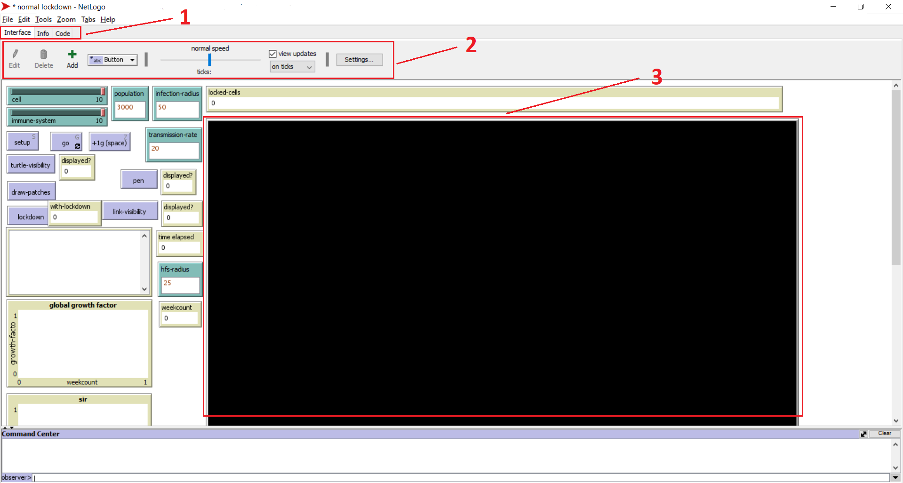
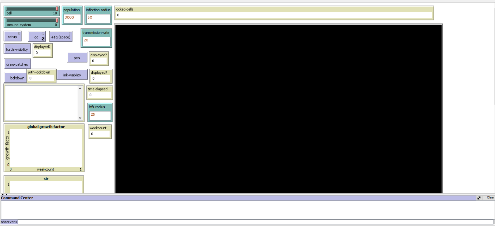
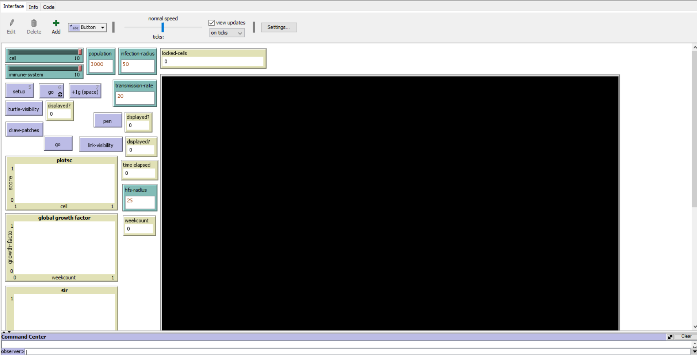

# Codes for Rapid Biological Threat Detection Model

This repository contains two files; normal lockdown and RBTD lockdown. The files can be opened with Netlogo 2D (https://ccl.northwestern.edu/netlogo/).

## Basic setup

Upon opening any of the two files, the user will see the netlogo user interface.

Based from the image above, the following is crucial for setting up the simulation:

1. Choosing interface will display simulation interface and choosing Code will display simulation code.
2. The following netlogo tools is useful in the simulation:
    - normal speed - adjusting ticks will fast forward the simulation
    - view updates - unchecking will make the simulation faster but not display updates. Recheck to view updates again.
    - Settings - it is crucial for the experiment since it divides the environment to equally sized cells. When the **cell** slider value is 10, it divides the environment to 100 equally sized areas. Make sure that the environment size is equally divisible when choosing a **cell** value.
        - For example: setting **max-pxcor** and **max-pycor** to 8 (0-8 is 9 patches, 9x9 patches in total) and setting **cell** to 3 is acceptable, the output environment would be a 3x3 cell with each cell having 3x3 patches.
3. The netlogo canvas will display the state of the simulation.
4. The simulation buttons will help in setting up the simulation. (cell, immune-system, population, etc.)

## Normal Lockdown

The **normal lockdown.nlogo** file has two modes: when setting up, the **lockdown** button is set to true which enables lockdown in the simulation, when set to false, it disables lockdown in the simulation.

Inputs:

1. cell - setup the cell dimension of the environment to value x value.
2. immune-system - the higher the immune system, the more likely humans are faster to recover.
3. population - the number of humans to spawn.
4. infection-radius - the radius of the threat in the environment.
5. transmission-rate - value% represents how infected humans are likely to infect other humans.
6. hfs-radius - radius of health facilities observation area.

toggles:

1. turtle-visibility - hide/show agents in the environment. (for debugging)
2. pen - show paths traversed by agents in the environment. (for debugging)
3. lockdown - enable or disable lockdown in the simulation. (if choosing simulation with/without lockdown)

buttons:

1. setup - after setting input values, click setup to setup the environment. Wait for setup finished log.
2. go infinitely - move the simulation continiously. (can toggle on/off)
3. +1g - go for 1 tick.
4. draw-patches - draw patches in the environment. (for visual)

displays:

1. time elapsed - time it took for the simulation to run.
2. locked-cells - show list of cells currently in lockdown.
3. weekcount - show time elapsed in weeks.
4. log display - display simulation logs.
5. global growth factor graph - display global growth factor.
6. susceptible, infected, recovered plot - SIR plot over time.

## RBTD Lockdown

The **RBTD lockdown.nlogo** runs the lockdown simulation with rapid biological threat detection model. It also shows ranking of the most suspicious cells at current ticks.

Inputs:

1. cell - setup the cell dimension of the environment to value x value.
2. immune-system - the higher the immune system, the more likely humans are faster to recover.
3. population - the number of humans to spawn.
4. infection-radius - the radius of the threat in the environment.
5. transmission-rate - value% represents how infected humans are likely to infect other humans.
6. hfs-radius - radius of health facilities observation area.

toggles:

1. turtle-visibility - hide/show agents in the environment. (for debugging)
2. pen - show paths traversed by agents in the environment. (for debugging)

buttons:

1. setup - after setting input values, click setup to setup the environment. Wait for setup finished log.
2. go infinitely - move the simulation continiously. (can toggle on/off)
3. +1g - go for 1 tick.
4. draw-patches - draw patches in the environment. (for visual)

displays:

1. time elapsed - time it took for the simulation to run.
2. locked-cells - show list of cells currently in lockdown.
3. weekcount - show time elapsed in weeks.
4. plot sc - plot the suspicion scores of each cell.
5. global growth factor graph - display global growth factor.
6. susceptible, infected, recovered plot - SIR plot over time.

# Simulation 1: No lockdown intervention setup

The current version of the code already has initial inputs when opened. The following inputs are saved (alter when needed):

-   settings: **max-pxcor**=999, **max-pycor**=999 (the environment will have 1000 x 1000 patches)
-   **cell**=10: the environment will be divided into 10 x 10 equally sized cells.
-   **immune-system**=10: maximum human immunity. Setting to 0 means humans would more likely take more time to recover.
-   **population**=3000: for simulation with 3000 humans. Alter when necessary.
-   **infection-radius**=50: radius of threat area that spawns at the center of the environment.
-   **transmission-rate**=20: humans are 20% likely to be infected by other humans.
-   **hfs-radius**=25: observation radius of health facilities.

## Required settings for replicating simulation for 1000 humans

-   settings: **max-pxcor**=999, **max-pycor**=999 (the environment will have 1000 x 1000 patches)
-   **cell**=10: the environment will be divided into 10 x 10 equally sized cells.
-   **immune-system**=10: maximum human immunity. Setting to 0 means humans would more likely take more time to recover.
-   **population**=1000: for simulation with 3000 humans. Alter when necessary.
-   **infection-radius**=50: radius of threat area that spawns at the center of the environment.
-   **transmission-rate**=20: humans are 20% likely to be infected by other humans.
-   **hfs-radius**=25: observation radius of health facilities. (**Not required for current simulation**)

## Required settings for replicating simulation for 3000 humans

-   settings: **max-pxcor**=999, **max-pycor**=999 (the environment will have 1000 x 1000 patches)
-   **cell**=10: the environment will be divided into 10 x 10 equally sized cells.
-   **immune-system**=10: maximum human immunity. Setting to 0 means humans would more likely take more time to recover.
-   **population**=3000: for simulation with 3000 humans. Alter when necessary.
-   **infection-radius**=50: radius of threat area that spawns at the center of the environment.
-   **transmission-rate**=20: humans are 20% likely to be infected by other humans.
-   **hfs-radius**=25: observation radius of health facilities. (**Not required for current simulation**)

## Running no lockdown simulation

1. **Set** the required settings for the simulation.
2. **Click** setup button and wait for **logs** that the simulation setup is finished.
3. (**IMPORTANT!**) **Click** lockdown button, the display value should become false to disable lockdown.
4. **Click** go button to continiously run simulation.
5. (Optional) Watch simulation on canvas or unselect **view updates** to run simulation without display.
6. **Wait** for simulation to finish. (Watch logs for prompt)

# Simulation 2: Lockdown intervention setup

The current version of the code already has initial inputs when opened. The following inputs are saved (alter when needed):

-   settings: **max-pxcor**=999, **max-pycor**=999 (the environment will have 1000 x 1000 patches)
-   **cell**=10: the environment will be divided into 10 x 10 equally sized cells.
-   **immune-system**=10: maximum human immunity. Setting to 0 means humans would more likely take more time to recover.
-   **population**=3000: for simulation with 3000 humans. Alter when necessary.
-   **infection-radius**=50: radius of threat area that spawns at the center of the environment.
-   **transmission-rate**=20: humans are 20% likely to be infected by other humans.
-   **hfs-radius**=25: observation radius of health facilities.

## Required settings for replicating simulation for 1000 humans

-   settings: **max-pxcor**=999, **max-pycor**=999 (the environment will have 1000 x 1000 patches)
-   **cell**=10: the environment will be divided into 10 x 10 equally sized cells.
-   **immune-system**=10: maximum human immunity. Setting to 0 means humans would more likely take more time to recover.
-   **population**=1000: for simulation with 3000 humans. Alter when necessary.
-   **infection-radius**=50: radius of threat area that spawns at the center of the environment.
-   **transmission-rate**=20: humans are 20% likely to be infected by other humans.
-   **hfs-radius**=25: observation radius of health facilities.

## Required settings for replicating simulation for 3000 humans

-   settings: **max-pxcor**=999, **max-pycor**=999 (the environment will have 1000 x 1000 patches)
-   **cell**=10: the environment will be divided into 10 x 10 equally sized cells.
-   **immune-system**=10: maximum human immunity. Setting to 0 means humans would more likely take more time to recover.
-   **population**=3000: for simulation with 3000 humans. Alter when necessary.
-   **infection-radius**=50: radius of threat area that spawns at the center of the environment.
-   **transmission-rate**=20: humans are 20% likely to be infected by other humans.
-   **hfs-radius**=25: observation radius of health facilities.

## Running lockdown simulation

1. **Set** the required settings for the simulation.
2. **Click** setup button and wait for **logs** that the simulation setup is finished.
3. (**IMPORTANT!**) **Check** lockdown button, the display value should be true to enable lockdown.
4. **Click** go button to continiously run simulation.
5. (Optional) Watch simulation on canvas or unselect **view updates** to run simulation without display.
6. **Wait** for simulation to finish. (Watch logs for prompt)

# Simulation 3: RBTD Lockdown intervention setup

The current version of the code already has initial inputs when opened. The following inputs are saved (alter when needed):

-   settings: **max-pxcor**=999, **max-pycor**=999 (the environment will have 1000 x 1000 patches)
-   **cell**=10: the environment will be divided into 10 x 10 equally sized cells.
-   **immune-system**=10: maximum human immunity. Setting to 0 means humans would more likely take more time to recover.
-   **population**=3000: for simulation with 3000 humans. Alter when necessary.
-   **infection-radius**=50: radius of threat area that spawns at the center of the environment.
-   **transmission-rate**=20: humans are 20% likely to be infected by other humans.
-   **hfs-radius**=25: observation radius of health facilities.

## Required settings for replicating simulation for 1000 humans

-   settings: **max-pxcor**=999, **max-pycor**=999 (the environment will have 1000 x 1000 patches)
-   **cell**=10: the environment will be divided into 10 x 10 equally sized cells.
-   **immune-system**=10: maximum human immunity. Setting to 0 means humans would more likely take more time to recover.
-   **population**=1000: for simulation with 3000 humans. Alter when necessary.
-   **infection-radius**=50: radius of threat area that spawns at the center of the environment.
-   **transmission-rate**=20: humans are 20% likely to be infected by other humans.
-   **hfs-radius**=25: observation radius of health facilities.

## Required settings for replicating simulation for 3000 humans

-   settings: **max-pxcor**=999, **max-pycor**=999 (the environment will have 1000 x 1000 patches)
-   **cell**=10: the environment will be divided into 10 x 10 equally sized cells.
-   **immune-system**=10: maximum human immunity. Setting to 0 means humans would more likely take more time to recover.
-   **population**=3000: for simulation with 3000 humans. Alter when necessary.
-   **infection-radius**=50: radius of threat area that spawns at the center of the environment.
-   **transmission-rate**=20: humans are 20% likely to be infected by other humans.
-   **hfs-radius**=25: observation radius of health facilities.

## Running RBTD lockdown simulation

1. **Set** the required settings for the simulation.
2. **Click** setup button and wait for **logs** that the simulation setup is finished.
3. **Click** go button to continiously run simulation.
4. (Optional) Watch simulation on canvas or unselect **view updates** to run simulation without display.
5. **Wait** for simulation to finish. (Watch logs for prompt)
